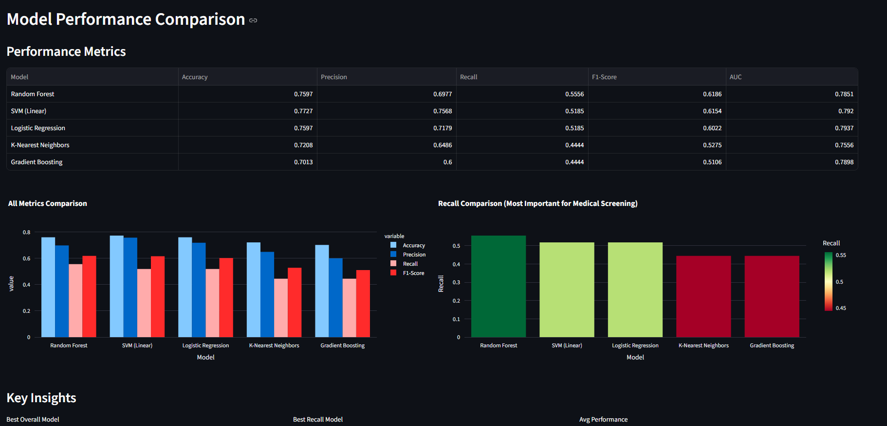
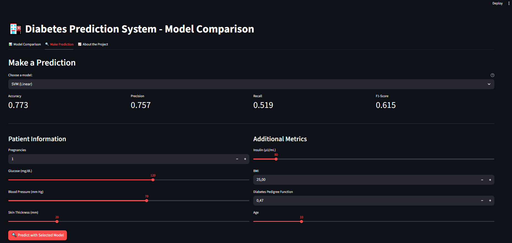
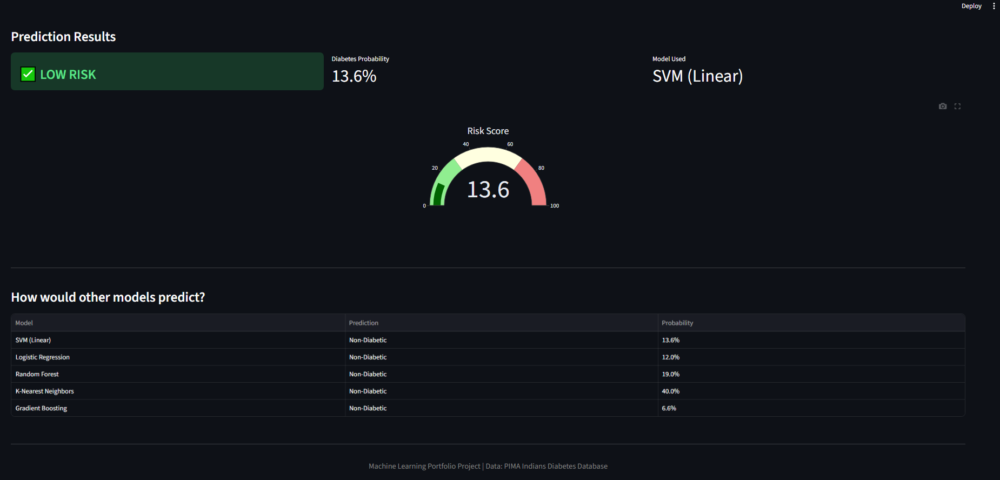

# 🏥 Diabetes Prediction System

A comprehensive machine learning project for predicting diabetes risk using the PIMA Indians Diabetes Database. This project demonstrates the complete ML workflow: from data cleaning and exploratory analysis to model comparison and deployment.


🔗 **[Live Demo](https://diabetes-prediction-ml-wchibout.streamlit.app/)** | 📊 [View Code](https://github.com/Willennn/Diabetes-Prediction-ML)


## 📸 Application Screenshots


### Model Comparison Dashboard
  


### Make a Prediction
  


### Model Comparison Results


*Interactive Streamlit application for diabetes risk prediction*


## 🎯 Project Overview

This project started as a tutorial implementation and was significantly expanded with:
- Advanced data quality analysis and cleaning
- Comprehensive exploratory data analysis (EDA)
- Comparison of 5 different ML algorithms
- Focus on medical-relevant metrics (Recall over Accuracy)
- Interactive web application for model deployment


## 📊 Key Findings

**Initial Approach (Tutorial):**
- Single model (SVM) with 77% accuracy
- No data quality checks
- Only accuracy metric considered

**Problems Discovered:**
- 652 medically impossible zero values (48% of rows affected)
- Accuracy was misleading: only 52% recall (missing half of diabetic patients)
- Dataset quality limitations not addressed

**Final Results:**
- After data cleaning and comparing 5 algorithms
- Best model: Random Forest with 56% recall
- Improved detection of diabetic patients by 4%
- **Key insight:** Dataset size and quality are the main limitations


## 📈 Model Performance Comparison

| Model | Accuracy | Precision | Recall | F1-Score | AUC |
|-------|----------|-----------|--------|----------|-----|
| Random Forest | 0.760 | 0.698 | 0.556 | 0.619 | 0.785 |
| Logistic Regression | 0.760 | 0.718 | 0.519 | 0.602 | 0.794 |
| SVM (Linear) | 0.773 | 0.757 | 0.519 | 0.615 | 0.792 |
| Gradient Boosting | 0.701 | 0.600 | 0.444 | 0.511 | 0.790 |
| K-Nearest Neighbors | 0.721 | 0.649 | 0.444 | 0.527 | 0.756 |

**Why Recall Matters:** In medical screening, missing a diabetic patient (false negative) is more dangerous than a false alarm (false positive). We prioritized recall over accuracy.


## 🛠️ Technologies Used

- **Python 3.x**
- **Data Analysis:** Pandas, NumPy
- **Visualization:** Matplotlib, Seaborn, Plotly
- **Machine Learning:** Scikit-learn
  - SVM (Support Vector Machine)
  - Logistic Regression
  - Random Forest
  - K-Nearest Neighbors
  - Gradient Boosting
- **Deployment:** Streamlit
- **Environment:** Jupyter Notebook


## 📁 Project Structure
```
diabetes-prediction-ml/
│
├── screenshots/
│   ├── comparison.png
│   ├── Prediction.png
│   └── results.png
│
├── Diabetes_Prediction.ipynb    # Main analysis notebook
├── app.py                        # Streamlit web application
├── diabetes.csv                  # Original dataset
├── diabetes_models.pkl           # Saved trained models
├── README.md                     # Project documentation
└── requirements.txt              # Python dependencies
```


## 🚀 Getting Started

### Prerequisites
bash
pip install numpy pandas scikit-learn matplotlib seaborn streamlit plotly
Running the Analysis

Open Diabetes_Prediction.ipynb in Jupyter Notebook
Run all cells to reproduce the analysis
The notebook will generate diabetes_models.pkl

Running the Web Application
bashstreamlit run app.py
The application will open in your browser at http://localhost:8501


## 💡 Project Workflow

1. Data Collection & Exploration

Loaded PIMA Indians Diabetes Database (768 patients, 8 features)
Analyzed class distribution (65% non-diabetic, 35% diabetic)
Identified feature correlations with diabetes outcome


2. Data Quality Analysis

Critical Discovery: 652 medically impossible zero values

Glucose: 5 zeros
Blood Pressure: 35 zeros
Insulin: 374 zeros (49% of data!)
BMI: 11 zeros
Skin Thickness: 227 zeros


3. Data Cleaning

Replaced zeros with NaN for impossible values
Implemented class-aware median imputation

Preserved differences between diabetic and non-diabetic patients
Better than global mean/median imputation


4. Exploratory Data Analysis (EDA)
Created visualizations to understand patterns:

Distribution of classes
Correlation heatmap
Feature distributions by outcome
Boxplots for outlier detection
Pairplots for feature relationships

Key Insights:

Glucose shows strongest correlation (0.47) with diabetes
BMI second strongest predictor (0.29)
Diabetic patients have 28% higher glucose on average
Age and pregnancies also significant factors


5. Model Development & Comparison

Standardized features using StandardScaler
80/20 train-test split with stratification
Trained 5 different algorithms
Evaluated with multiple metrics (not just accuracy)
Performed 5-fold cross-validation


6. Evaluation with Medical Context

Accuracy alone is insufficient for medical diagnosis
Focused on Recall (Sensitivity): catching diabetic patients
Analyzed confusion matrices to understand error types
ROC-AUC curves for discrimination ability


7. Deployment

Built interactive Streamlit application
Model comparison interface
Real-time predictions with any selected model
Visual risk indicators and recommendations


📝 Key Learnings
Technical Skills

Data quality assessment is crucial before modeling
Domain-specific metrics matter (recall > accuracy for medical)
Model comparison reveals algorithm strengths/weaknesses
Ensemble methods don't always guarantee improvement


Professional Insights

Dataset quality limits model performance more than algorithm choice
Being honest about limitations shows maturity
Good documentation makes projects portfolio-ready
Interactive demos make ML accessible to non-technical users


What I Would Do Differently
In a real medical project, I would:

- Collect more data (768 samples is small for ML)
- Add modern biomarkers (HbA1c, fasting insulin, lipid panels)
- Include detailed family history
- Use temporal data (monitoring over time)
- Collaborate with medical professionals for feature engineering


⚠️ Important Disclaimer
This is an educational project demonstrating machine learning workflows. It is NOT intended for actual medical diagnosis. Always consult healthcare professionals for medical advice.
The model's 56% recall means it misses 44% of diabetic patients, making it unsuitable for clinical use without significant improvements.


📚 Dataset Information
Source: PIMA Indians Diabetes Database
Size: 768 patients
Features: 8 medical measurements
Target: Binary classification (diabetic/non-diabetic)
Features:

- Pregnancies: Number of pregnancies
- Glucose: Plasma glucose concentration
- BloodPressure: Diastolic blood pressure (mm Hg)
- SkinThickness: Triceps skin fold thickness (mm)
- Insulin: 2-Hour serum insulin (mu U/ml)
- BMI: Body mass index (weight in kg/(height in m)²)
- DiabetesPedigreeFunction: Diabetes pedigree function (genetic factor)
- Age: Age in years


🤝 Contributing 

This is a personal learning project, but feedback and suggestions are welcome! Feel free to:
- Open issues for bugs or improvements
- Fork the repository for your own experiments
- Share insights or alternative approaches  


📧 Contact

CHIBOUT Willen
willen.chibout@gmail.com
https://www.linkedin.com/in/willen-chibout/  


  

📄 License
This project is open source and available under the MIT License.

Note: This project was developed as part of my machine learning portfolio to demonstrate:

- End-to-end ML project workflow
- Data quality awareness and handling
- Medical domain considerations in ML
- Model comparison and selection
- ML deployment and communication
